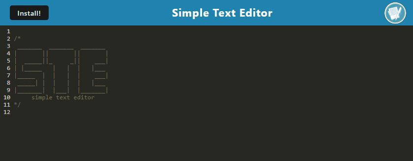
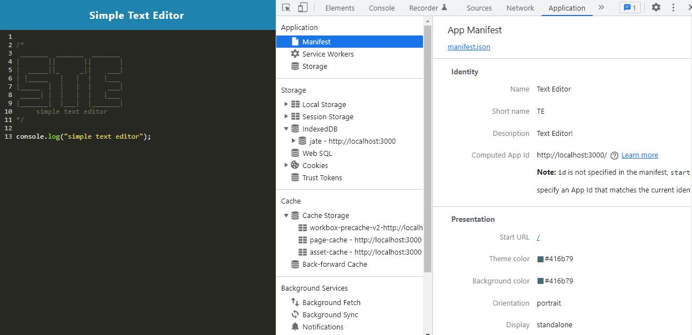
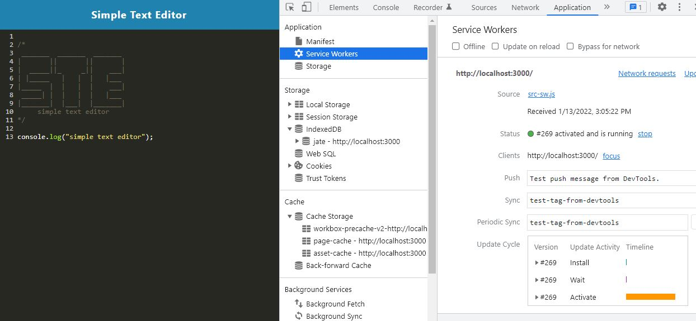
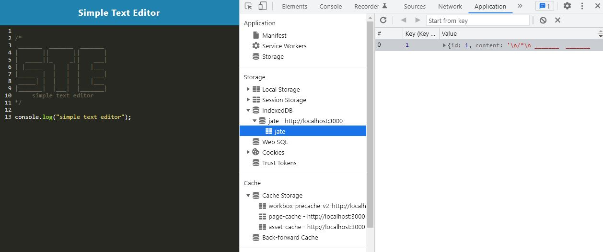

# Text Editor

[](https://opensource.org/licenses/ISC)
[](https://fathomless-caverns-06723.herokuapp.com/)


  ## Table of contents
  - [Description](#description)
  - [Installation instructions](#installation-instructions)
  - [Usage information](#usage-information)
  - [License](#license)
  - [Questions](#questions)


  ## Description

This is a text editor that runs in the browser. The app is a single-page application that meets the PWA criteria. Additionally, it will feature a number of data persistence techniques that serve as redundancy in case one of the options is not supported by the browser. The application will also function offline.

   [Check it on HEROKU](https://fathomless-caverns-06723.herokuapp.com/)
  
  

  The following image shows the application's manifest.json file:
  

  The following image shows the application's registered service worker:
  

  The following image shows the application's IndexedDB storage:
  

  ## Installation instructions

  For dependancies run following comand:

  ```npm install```

  ## Usage information

  To use this app on localhost - run the following commands:

  ``npm run build``

  ``npm run start:dev``

  ## License

  [](https://opensource.org/licenses/ISC)

  Usage is provided under [The ISC License](https://opensource.org/licenses/ISC). See LICENSE for the full details.

  ## Questions

  To reach me with additional questions

  GitHub: [Juliusm9791](https://github.com/Juliusm9791)

  Email: juliusm9791@gmail.com

